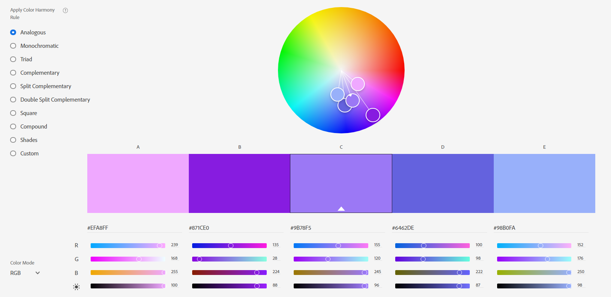

Margaret Earnest
https://a1-margaretearnest.glitch.me/

This project shows ...

## Technical Achievements
- **Styled page with CSS**: 
	- set elements in the body to display as in-line blocks so that the background highlight for elements wouldn't span the page
	- set the script to not display since setting everything to in-line block made it visible
	- set list items to display as list items since they were also changed to in-line block
	- set the margin of h1 and h2 to 0
	- gave h1, h2, and h3 a shadow
- **Added a simple Javascript animation**: used the jQuery flicker effect on elements when the mouse enters them and off when it exits them
- **Added extra HTML tags**: 
	- used ```<br>``` to break lines after setting each element to in-line block
	- used ```<i>``` to emphasize my degree
	- used ```<strong>``` to highlight language titles and seperate them from their experience rating
	- used ```<ol>``` to show the order of CS classes taken

### Design Achievements
- **Used the Josefin Slab Font from Google Fonts**: used Josefin Slab as the font for all of the text on the site
- **Made a color scheme**: 
	- used #EFA8FF for a hover highlight on each element (converted to rgba in the code to allow for transparency)
	- used #871CE0 as the default text color
	- used #9B78F5 and #98B0FA as the values the background fades between
	- used #6462DE as the text highlight color




