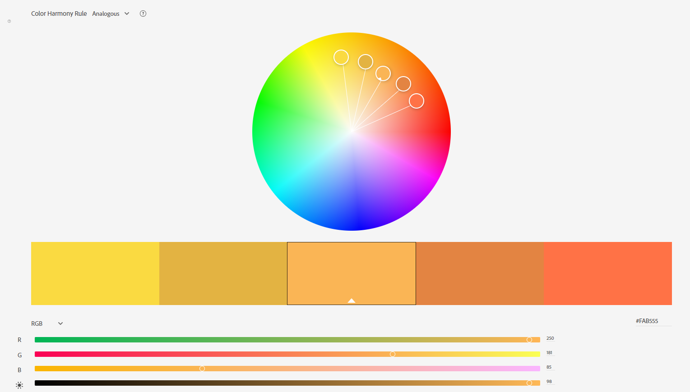

Readme
---

Jialin Song
https://a1-jsong2333333.glitch.me/

This assignment includes a simple website created with my information. I've taken this class at last year A term, so you would find some similarity in this submitted assignment. However, a large portion of web page has been modified and added with new technical and design achievements.

### Technical Achievements
- **Page Styling with CSS**: Inside file "style.css", rules were set separately for headings(1,2,3); table; list; button(before click and hover); division. Color, font, border, paddings were modified in almost every rule.
- **JavaScript Animation**: Animation was added on buttons, which were designed to be collapsible. The code of this animation was written in "animation.js". For this achievement, I wrote the onclick event listener based on the reference from *w3schools*: [Link](https://www.w3schools.com/howto/howto_js_collapsible.asp), but slightly simplified.
- **Other HTML Tags**: Inside the web page, link, image, table, button and division tags were used.

### Design Achievements
- **Color Palette Used**:  Colors in this color pallete were implemented in the CSS, including #FADB41, #E3B342, #FAB555, #E38242, #FF7045 (from left to right shown in the screenshot).
- **Google Fonts**: Two Google fonts were used in this web page: *Cinzel* and *Cormorant* with larger weights for headings and smaller weight for contents.

### One Notice
When "outset" was used as the style of borders, the appearance color of the border won't be the same as your input just because this style is meant to look "embossed". To maintain the color of your choice, "solid" style should be used instead.