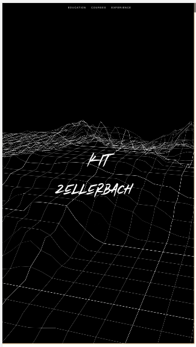

A1 README
---

Kit Zellerbach
https://a1-kitzeller.glitch.me/

This project shows some of my current HTML, CSS, Javascript and Design skills.

## Technical Achievements
- Used knowledge of Babylon.js to implement a custom 3D "grid heightmap" header background
- Used jQuery.js and TypeIt.js to create a custom interactive experience in which the user
watches the site "build itself". I figured out how to combine jquery and typeit to create this experience 
without any additional resources.

### Design Achievements
- No templates/external css files were used for this project (besides the default bootstrap css).
- Designed the interactive experience from scratch, for example, figured out the best timing, 
color scheme, animation speed, auto-scroll behavior.
- Implemented a minimalist greyscale design.
- Attention to minor details to improve interactivity, such as color changes onhover.
- The website is responsive and adapts to mobile version (through use of bootstrap).
- All the CSS is custom coded for this site.
- Added soft synthetic sound to further the user experience.

**Mobile Version**

**Video Demo (Click Thumbnail)**

